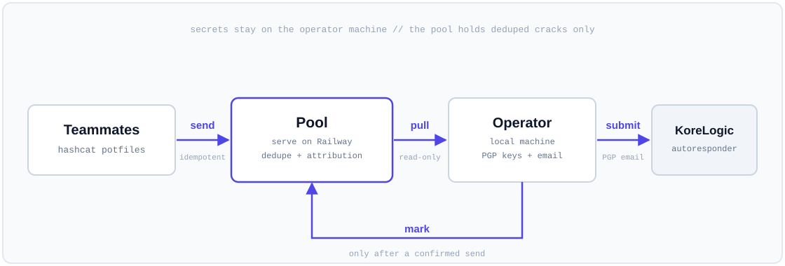

# Architecture



## Design philosophy

One goal drove every decision: **there is no wrong way to use it.** A password
contest weekend is 48 hours of tired people running commands at 3 AM. The tool
has to be safe to fumble. So:

- Uploads are idempotent. Re-run `send` as often as you like.
- Reads never change state. `pull` cannot hurt anything.
- Cracks are marked submitted only after a send you confirmed.
- If you skip a step, the next run picks up whatever was missed.

Three secondary principles fall out of that:

1. **The server owns correctness.** Clients are deliberately dumb. All dedupe,
   attribution, and marking logic lives in one place (`internal/store`) so there
   is exactly one thing to reason about, not N client copies that can drift.
2. **Minimal surface.** One binary, two tables, two external dependencies, the
   standard library for everything else. Fewer moving parts means fewer failure
   modes to debug mid-contest.
3. **Secrets stay local.** The hosted component never holds a private key or the
   contest email account. If the pool were fully compromised, the attacker gets
   deduped cracks, not your identity or your ability to submit as your team.

## One binary, five modes

| mode     | runs where       | touches DB | holds secrets |
|----------|------------------|:----------:|:-------------:|
| `serve`  | Railway (hosted) | yes        | no            |
| `send`   | every teammate   | no         | no            |
| `pull`   | operator local   | no         | yes (PGP)     |
| `submit` | operator local   | no         | yes (PGP + email) |
| `stats`  | anyone           | no         | no            |

`serve` is the only process with a database connection. The rest are HTTP
clients. This is what keeps key material off the host that faces the internet.

## Module layout

```
cmd/cmiyc            entrypoint: subcommand dispatch, flag parsing, env fallbacks
internal/server      net/http API, bearer auth, routing, request size limits
internal/store       pgx pool, embedded schema, dedupe/attribution/mark SQL
internal/client      send/pull/submit/stats orchestration + local artifacts
internal/pgpcrypto   encrypt-to-recipient with optional signing
internal/potfile     opaque line parsing + sha256 dedupe
```

## Data model

Two tables, defined in `internal/store/schema.sql`.

### `cracks`

The unique source of truth. One row per distinct cracked line.

- `line`: the exact normalized text, opaque `hash:plaintext`.
- `line_hash`: `sha256(line)`, `UNIQUE`. The dedupe key.
- `first_by`: the teammate who first submitted this line. Attribution of the
  race winner.
- `submitted_at`: `NULL` means pending. This column is the entire submission
  state machine.

A partial index on `(id) WHERE submitted_at IS NULL` keeps pending scans cheap.

### `crack_contributors`

A bounded set: `PRIMARY KEY (crack_id, author)`. One row per distinct teammate
who has ever uploaded a given line. Idempotent re-uploads collapse via
`ON CONFLICT DO NOTHING`, so this table does not grow when people re-send the
same potfile on a loop.

This is the post-contest analytics surface. From it you get, without an
unbounded event log:

- first-crack attribution per teammate (`cracks.first_by`),
- how many lines each teammate independently held,
- overlap: lines cracked independently by more than one teammate.

An append-only event log was considered and rejected: because clients re-post
whole potfiles frequently, an event-per-observation table would be almost
entirely duplicate rows. The contributor set captures the same signal with
bounded storage.

## The submit / mark correctness core

This is the subtle part, and the reason the store owns it.

### Why not "mark everything up to the highest id"

`id` is a `BIGSERIAL`. Serials are handed out in request order but commit in
completion order, so ids can become visible out of order. If a `pull` snapshot
read up to id N and then marked everything with `id <= N`, a crack that was
assigned id N-1 but committed *after* the snapshot would be marked submitted
without ever being sent. Silent loss. Rejected.

### Set-exact marking

Instead, `pull` records the exact ids it bundled into a sidecar file
(`submission_<iter>.ids.json`). `submit` marks only those ids, and the UPDATE is
guarded:

```sql
UPDATE cracks SET submitted_at = now()
WHERE id = ANY($1::bigint[]) AND submitted_at IS NULL;
```

A crack that raced in after the snapshot is simply not in the id set, so it can
never be marked by that submit. It stays pending and the next `pull` picks it up.

### Why `--full` is a safe superset

`pull --full` fetches every crack, each tagged with `was_pending` (true iff
`submitted_at IS NULL` at read time). It ships the whole set to KoreLogic, which
dedupes on their end, so re-shipping already-submitted lines is harmless on the
wire. But the sidecar it writes contains only the `was_pending` ids. So a
`--full` submit:

- re-asserts every crack to KoreLogic (mops up anything a prior send dropped),
- advances the baseline for exactly the lines that were still pending,
- cannot falsely mark a line that raced in after the snapshot,
- needs no follow-up `pull`.

A plain `pull` is literally the `was_pending == true` slice of `--full`, sharing
the same code path, so the two behaviors cannot drift apart.

## The bulk upsert

`send` posts the entire potfile; the server parses, dedupes, and upserts it in
one statement per chunk. The statement uses `unnest` to zip parallel arrays of
`(line_hash, line)`, deduplicates within the batch, inserts new cracks with
`ON CONFLICT (line_hash) DO NOTHING`, and registers the author as a contributor
to every line in the batch.

One PostgreSQL subtlety shapes the SQL: data-modifying CTEs are not visible to
sibling reads within the same statement. So newly inserted crack ids are
captured through the `INSERT ... RETURNING` of the `ins` CTE and unioned with a
separate read of pre-existing ids, rather than by re-selecting from `cracks`
(which would see only the pre-statement snapshot).

## Opaque lines

A "line" is never split on `:`. Plaintexts legally contain colons and arbitrary
UTF-8, and for the crypt families that carry the contest points (bcrypt,
md5crypt, sha512crypt, descrypt) the raw hashcat potfile line already is exactly
what KoreLogic wants. The only normalization is trimming a trailing CR or LF, so
the same crack hashes identically regardless of the uploader's line endings. A
few network/auth formats need `hashcat --show` output instead; see
`docs/HASH_FORMATS.md`.

## What was intentionally left out

- No web UI. The CLI is the interface.
- No auth beyond a shared bearer token. For a small trusted team this is the
  right tradeoff; `docs/DEPLOY.md` covers hardening options if you want per-user
  tokens.
- No message queue, cache, or background worker. Postgres is the only state.
- No client-side delta tracking. The server is the single arbiter of what is new
  and what is pending, so clients never need to remember what they sent.
